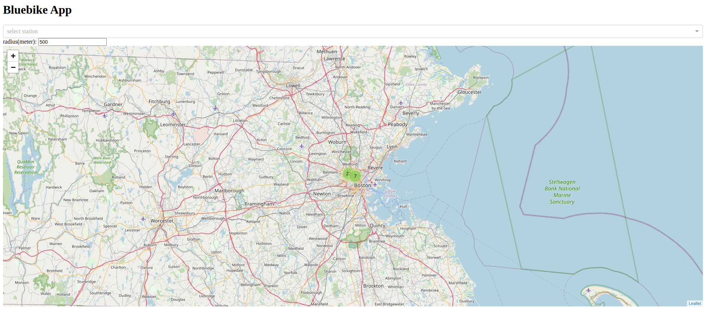
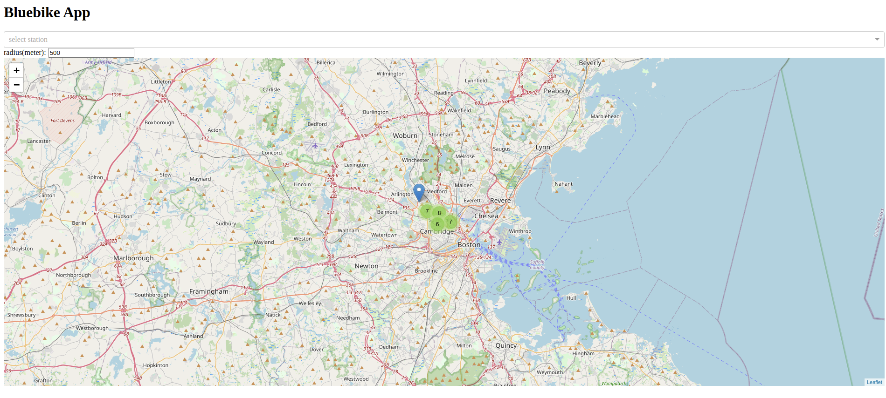
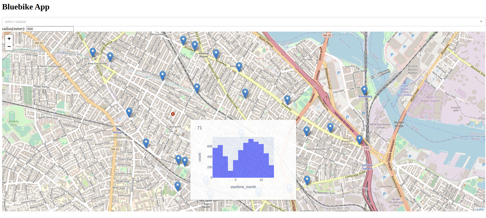
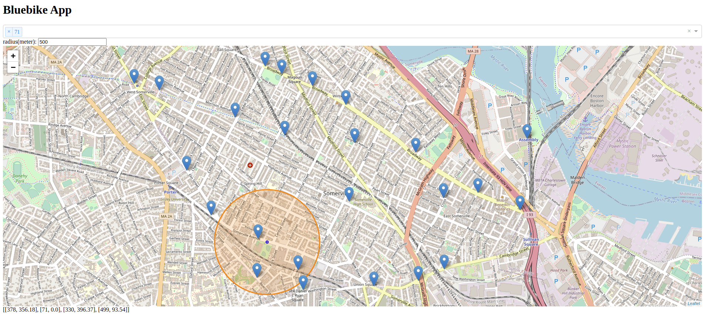
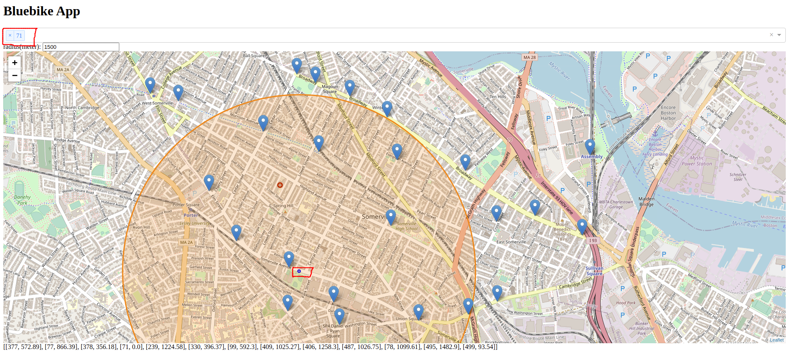

# Bike rental application using Python Dash and Dash-leaflet

### how to use
1. run the Dash_bike_App.py file and it will show a localhost ip
2. input the ip to the browser which will show the App on you local web browser

### background
* This is a project to understand GIS map operations using Python Dash
    - it uses some of the public data provided by [Bluebike](https://www.bluebikes.com/system-data).
    - packages used in this application 
        * Dash: provide user interface
        * dash_leaflet: provide operations on map
        * dash_extensions: provide advanced operations on map markers
        * folium: map operations (add layers to maps)
        * pandas: data processing
        * networkx and osmnx: for GIS network operations (e.g. calculating shortest path)

### functionalities
1. bike station markers and auto clustering when zoom out

2. marker hover feature
    - when hover on the bike station maker, show the station rental traffics
    

3. stations inside a radius
    - Specify the radius, and then when click the marker of each station, it will display the included stations IDs and their direct distance (meters) from the clicked station. And display those stations as a nested list
    

    - click the marker is the same as select from the dropdown menu (the two red rectangles)
    

4. shortest routes between two stations
    - support selection of two stations (start and end)
    - support calculating shortest routes between them
    ![shortestPath][img/bike18.png]

### A short demo

